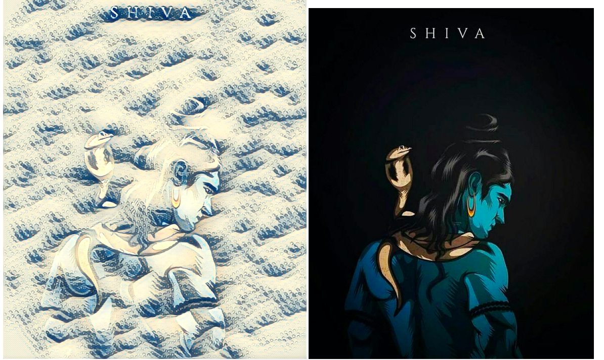
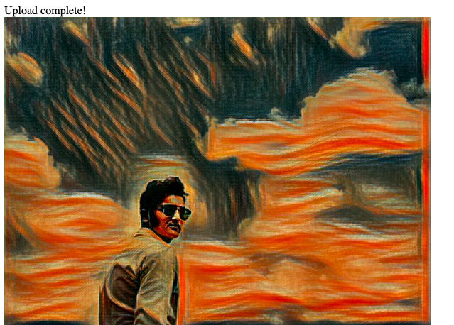
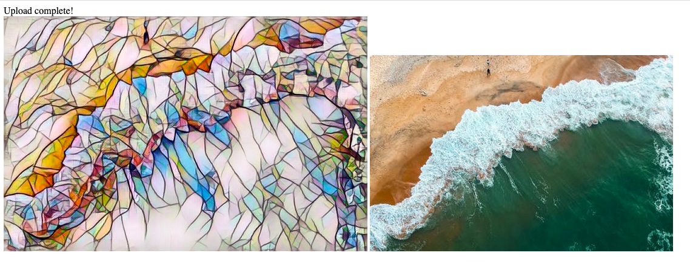
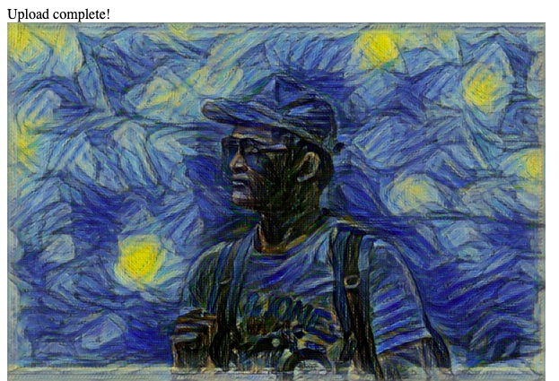
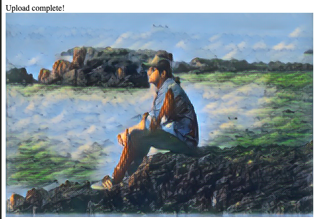
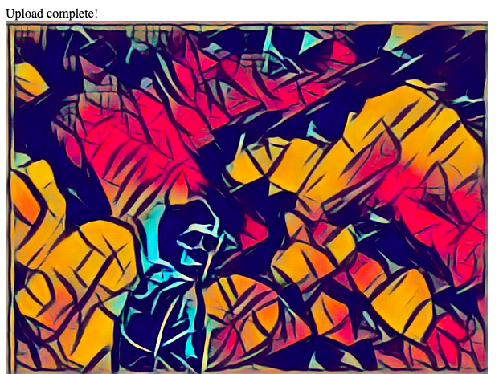
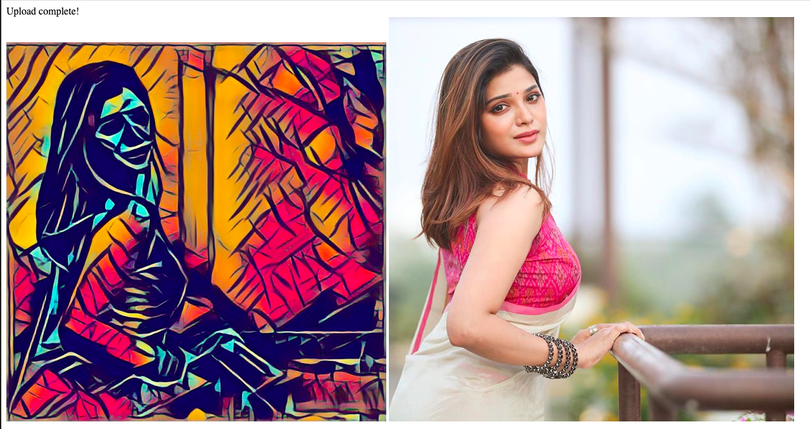
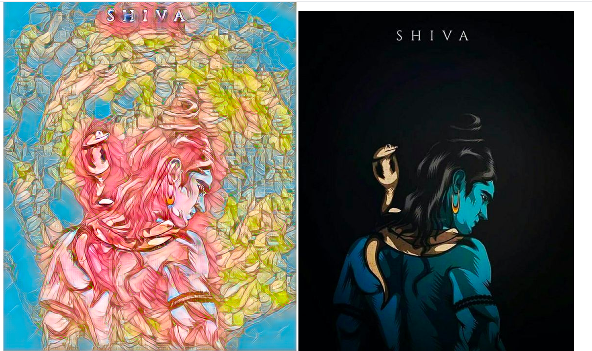
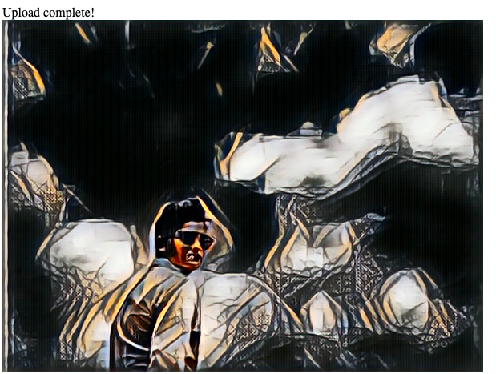
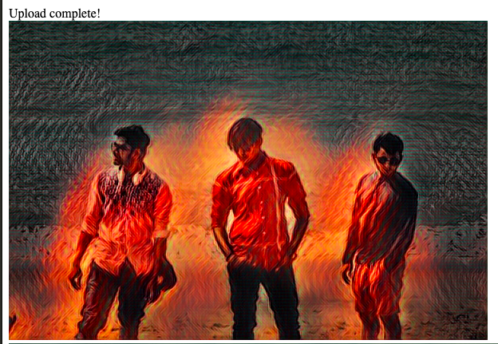

# Neural-style-transfer

## PROJECT DEFINITION
Neural style transfer is an optimization technique used to take two images— a content image and a style reference image (such as an artwork by a famous painter)—and blend them together so the output image looks like the content image, but “painted” in the style of the style reference image.
## MODEL USED
In neural networks, Convolutional neural network (ConvNets or CNNs) is one of the main categories to do images recognition, images classifications. Objects detections, recognition faces etc., are some of the areas where CNNs are widely used.

